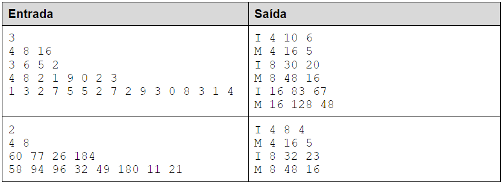

Faça um programa em C que receba o número Q de vetores. Após isso, deve ser lido o tamanho N de cada um dos Q vetores. Em seguida, leia cada vetor. O programa deve ordenar os vetores utilizando os método de inserção e merge. Ao final deve-se imprimir o número de trocas e comparações realizadas por ambos os métodos em cada vetor, conforme a seguinte formatação: “M N T C”, onde M é o método (I para inserção e M para merge), N é o tamanho do vetor, T é o número de trocas e C é o número de comparações.

Observações importantes:

Somente comparações e trocas que envolvam elementos do vetor devem ser contadas. Por exemplo, comparações do tipo i < fim não envolvem elementos do vetor, ao contrário de comparações do tipo x > vetor[i], que envolve o vetor a ser ordenado.
Considerar o conceito de "curto circuito" em C. Por exemplo, na expressão if (i > 0 && v[i] > x), quando i > 0 é falso, a comparação v[i] > x não é realizada.

